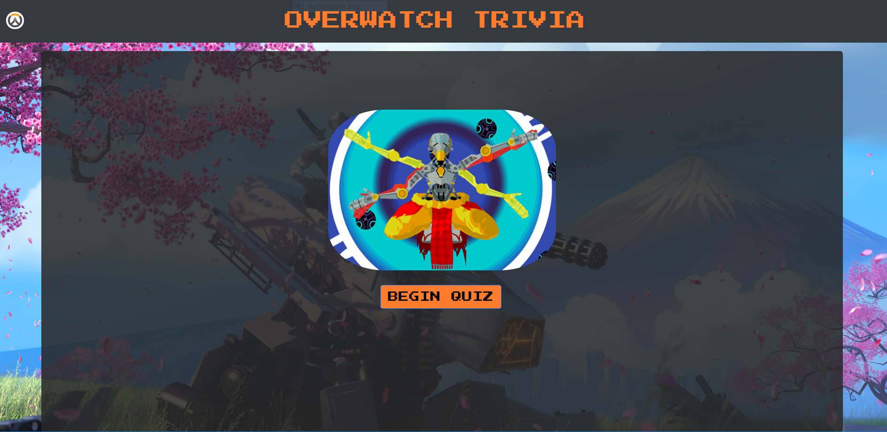

Overwatch Trivia
=======================================
A timed trivia game I made for my full-stack coding bootcamp. The theme and questions are based on the game Overwatch!   

## Technologies Used
+ Page elements and styling were done with HTML and CSS, and the game logic with Javascript. 
  
+ I used the jQuery library to dynamically update elements on my page and added timed functionality for my trivia questions within my game logic. 
  
+ Build using the Bootstrap CDN for general page layout and added responsiveness, as well as the animate.css CDN for some of the animations.

## Gameplay

1. Hit the button labelled "begin" and the first question will appear on the screen.
2. You have 10 seconds to answer the question!
3. The game will tell you if you got it right, or tell you the right answer if you got it wrong.
4. You can see your total score at the end, and try again if you want :2nd_place_medal:.

[Click here to play!](https://thornolan.github.io/TriviaGame/ "deployed game")
